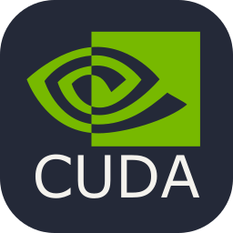

    

<h1 align="left">
hello! 😊
</h1>

    • undergraduate computer engineering student at ufpb 🇧🇷
     
    • a guy who has a coding project bucketlist way bigger than the time he has to complete it!
     
    • big-time (keyboards, music, photography, math, and books) · lover.

 

  
  
  

<h2 align="left"> ⚙️ - ongoing projects: </h2>

    • making improvements to quantum algorithms @ <a href="https://github.com/QUASAR-UFPB">QUASAR</a>
     
    • cooking the best tech-assisted music-composition experience.
     
    • a couple AI tinkering <a href="https://github.com/luanmtt/fragNN">here</a> and <a href="https://github.com/luanmtt/kiAI">there</a>

<h2 align="left">💡- i want to: </h2>

    ◦ learn qiskit, pennylane
     
    ◦ make a 50% keyboard project from scratch,
     
    ◦ master C.Architecture, CUDA, HPC
     
    ◦ get proficient in Italian 🇮🇹.
     
    ◦ learn, learn, learn, learn!!

<h2 align="left"> </h2>

• you can find me here: <b>luanmotta.me@gmail.com</b> 📬 
 
• thank you for paying a visit! 😎

